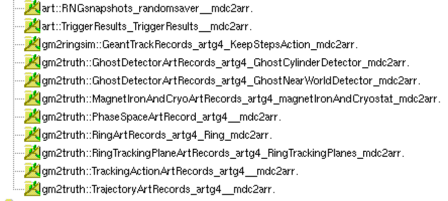

```{r setup, include=FALSE}
knitr::opts_chunk$set(cache=TRUE, autodep=TRUE)
```

# Introduction
Part of the Accelerator Readiness Review is looking at muons that leave the ring. To this end, we (Renee, Nathan, James, and myself) have a preliminary version of MDC-2 with full injection, unified fields, and "ghost" detectors in a Geant parallel world (so these sensitive volumes can be placed without overlapping physical structures). We can remove various magnets and fields and see how that affects muons escaping the beam. 


```{r message=FALSE, warning=FALSE}
# Load libraries
library(readGallery)
library(stringr)
library(dplyr)
library(ggplot2)
library(rgl)
library(readr)
library(purrr)
library(parallel)
```


# Samples
I have run preliminary MDC-2 (using Renee's FCL files), making 10K events for various scenarios. Files are currently stored in `/pnfs/GM2/scratch/users/lyon/arr_20170313` and directories within. Ghost detectors included are Renee's cylinder just at the outer vacuum wall and encompossing the inflector as well as my ghost detector that is a cylindrical shell just on the inside of the world cube. Note that this code includes the magnet yoke steel. 

## Find the data
```{r}
# Let's look at only the 180* job series (so we just get 10,000 events per scenario)
system('ifdh ls /pnfs/GM2/scratch/users/lyon/arr_20170313/180*/*.root | grep .root', intern=T) %>% 
  xrootify() -> arrFiles
arrFiles
```
Let's pluck out the scenario.
```{r}
scenarios <- str_match(arrFiles, 'arr_20170313/.+_unified_(.+)_cyl')[,2]
scenarios
```

What data are in these file? Well, `product_sizes_dumper` doesn't seem to work across XRootD. That's too bad. 

Here's a picture from Root.



## Look at Tracking action data to see how mnay muons decay and how many escape

```{r}
useDataProduct('std::vector<gm2truth::TrackingActionArtRecord>')
```

Create a reader class (modify outside of this notebook) for TrackingActionArtRecord
```r
readerClassSkel('gm2truth::TrackingActionArtRecord', writeFile = 'trackingActionReader.py')
```

### `trackingActionReader`

For documentation, here is the `TrackingActionArtRecordReader` reader class
```{r}
readr::read_file('trackingActionReader.py') %>% cat
```

Make an instance
```{r}
trackingActionReaderClass <- createReaderClass_from_file('trackingActionReader.py')$TrackingActionArtRecordReader
```

Load the data - let's just look at one file since it takes a long time
```{r}
taReader <- trackingActionReaderClass(artInputTag("artg4"), 20000)
getGalleryData(arrFiles[1], taReader)
```
As of right now, the dCache XRootD door is done. 
```{r}
taDF <- galleryReader_df(trackingActionReader)
nrow(taDF)
```
Set the scenario (we'll need that again, so make it a function)
```{r}
setScenario <- function(df) {
  df %>% mutate(scenario = factor(fileEntry, levels=0:(length(scenarios)-1), labels=scenarios))
}
```

```{r}
taDF %>% setScenario() %>% select(scenario, everything()) -> taDF
taDF
```

How many track action hits do we get per scenario.
```{r}
taDF %>% group_by(scenario) %>% tally()
```

Let's just get the death of the muons. 

### Muon deaths in tracking action

```{r}
taDF %>% filter(status == 1) -> taDeathDF
```

We need the volume ID. I have a art FCL to run to get this information. I have `r cat(length(arrFiles))` files and they each may have a different set of volume IDs. Let's try to do this in parallel. The examples in the help for `parallel::mcparallel` seem to be useful here. 

Create the command strings,
```{r}
runForVolIDString <- function(i) {
  str_interp(
    "PVS_CSVOUT=${csvout}_volNames.csv gm2 -c ${fclPath}/gm2analyses/fcl/physicalVolumeStoreToFile.fcl -n 1 ${aFile}",
    list( csvout=scenarios[i], fclPath=Sys.getenv("MRB_BUILDDIR"), aFile=arrFiles[i]) 
  )
}

runForVolIDStrings <- sapply(1:length(arrFiles), runForVolIDString)
runForVolIDStrings
```

Let's run in parallel
```{r}
jobs <- lapply(1:length(arrFiles), function(i) mcparallel(system( runForVolIDStrings[i], intern=T ), name=i))
res <- mccollect(jobs)
```

Now we need to load the csv files. Let's do that in parallel too
```{r, message=FALSE}
jobs <- lapply(1:length(arrFiles), function(i) paste0(scenarios[i], "_volNames.csv") %>% read_csv(col_names=c("volumeUID", "volName")) %>% mcparallel(name=i) )
volNameTables <- mccollect(jobs)
names(volNameTables) <- scenarios
```

Let's see what we got
```{r}
volNameTables[["everything"]]
```
Join them together when the scenario name.
```{r}
volNameTable <- map2_df(volNameTables, scenarios, function(df, sce) df %>% mutate(scenario = sce) )
volNameTable
```

Now let's do lookups... [Note that I can't do what I originally thought, which was split up the data frame into groups by scenario and then put in the factor by group -- because in the end the rows get rejoined and then row-binded factor gets messed up.]

```{r}
taDeathDF -> hold # in case we mess up
taDeathDF %>% inner_join(volNameTable) %>% select(scenario, eventEntry, volName, everything()) -> taDeathDF
taDeathDF
```

We can check this -- we should see different volume names associated with volume IDs for different scenarios
```{r}
taDeathDF %>% distinct(scenario, volumeUID, volName) %>% arrange(volumeUID)
```

Let's plot where things die

```{r}
taDeathDF %>% group_by(scenario, volName) %>% tally() %>% arrange(scenario, desc(n)) -> deathVolumeTable
deathVolumeTable
```

Did any of them actually decay?
```{r}
taDeathDF %>% filter(volName == "ArcSection[00]")
```
Uh oh!!!! Hardly any decay!

```{r}
taDeathDF %>% ggplot( aes(x = volName) ) + geom_bar() + theme(axis.text.x = element_text(angle=90, hjust=1))
```

## Look at why hardly any muons decay. 

Let's look at the 'everything' scenario. 
```{r}
everythingFile <- which(scenarios == "everything")
```

I made a new TrackingAction reader

```{r}
readr::read_file('trackingActionReaderCheckDecay.py') %>% cat
```
Make an instance
```{r}
taDecayClass <- createReaderClass_from_file('trackingActionReaderCheckDecay.py')$TrackingActionWithDecayReader
```

Load the data - let's just look at one file since it takes a long time
```{r}
taReader <- taDecayClass(artInputTag("artg4"), 20000)
getGalleryData(arrFiles[5], taReader)
```
```{r}
tadDF <- galleryReader_df(taReader)
nrow(tadDF)
```
Make things easier to look at
```{r}
tadDF %>% mutate(r = sqrt(x*x+y*y)) %>% select(trackType, volumeUID, status, r, e, turn) -> tadDF
```

So I see an electron in alomst every case. But the muon appears to stop in the iron. Let's just plot x,z

```{r}
taDeathDF %>% ggplot(aes(x=z, y=x)) + 
  geom_point() + xlim(c(-10000, 10000))
```
```{r}
tmp <- open3d()
```
```{r}
ring <- cylinder3d( center=rbind(c(0,-90, 0), c(0,90,0)),
                    radius=7112,
                    sides=20, closed = F)
```
```{r}
clear3d()
with(taDeathDF, 
     plot3d(x=x, y=y, z=z, type='p', main='Muon death positions', 
       xlab="x", ylab="y", zlab="z", xlim=c(-9000, 9000), zlim=c(-9000, 9000)))
plot3d(ring, add=T, alpha=0.2)
view3d(phi=90, theta=-90)
rglwidget()
```
This really doesn't look like muons are being stored.


## Look at Renee's cylinder hits (this is the cylinder just in the outer wall of the vacuum chamber and around the inflector).
```{r}
useDataProduct('std::vector<gm2truth::GhostDetectorArtRecord>')
ghostCylinderInputTag = artInputTag('artg4:GhostCylinderDetector')
```

Create a reader class (modify outside of this notebook) for GhostDetectorArtRecord
```r
readerClassSkel('gm2truth::GhostDetectorArtRecord', writeFile = 'ghostDetectorReader.py')
```
Here's the reader class
```{r}
readr::read_file('ghostDetectorReader.py') %>% cat
```

Make an instance
```{r}
ghostDetectorReaderClass <- createReaderClass_from_file('ghostDetectorReader.py')$GhostDetectorArtRecordReader
ghostDetectorReader = ghostDetectorReaderClass(ghostCylinderInputTag)
```

Load the data
```{r}
getGalleryData(arrFiles, ghostDetectorReader)
```
```{r}
gcDF <- galleryReader_df(ghostDetectorReader)
```

How many events did we get?
```{r}
nrow(gcDF)
```
```{r}
head(gcDF)
```

Make factors...

Some common particles are
```{r}
# See  http://pdg.lbl.gov/2007/reviews/montecarlorpp.pdf for PDG value meanings
pdgs <- c('e-'= 11, 'nu_e'= 12, 'mu-'= 13, 'nu_mu'= 14, 'tau-'= 15, 'nu_tau'= 16,
          'e+'=-11, 'anti_nu_e'=-12, 'mu+'=-13, 'anti_nu_mu'=-14, 'tau+'=-15, 'anti_nu_tau'=-16,
          'gam'=22, 'p'=2212, 'n'=2112, 'anti-p'=-2212, 'anti-n'=-2112) 
pdgs
```


```{r}
gcDF %>% mutate(scenario = factor(fileEntry, levels=0:(length(scenarios)-1), labels=scenarios),
                pdg = factor(particleID, levels=pdgs, labels=names(pdgs))) %>% 
  select(scenario, eventEntry, pdg, everything())-> gcDF
gcDF
```

How many lost per scenario
```{r}
gcDF %>% filter(pdg == 'mu+') %>% group_by(scenario) %>% tally()
```
How many events?
```{r}
gcDF %>% group_by(scenario) %>% tally()
```


# See evidence of escaping muons

We can see the muons that escape the vacuum chamber by looking at the ghost detector Hits from Renee's detector (has art input tag of `artg4:GhostCylinderDetector`). We can also look at hits from my ghost detector that sits just inside the world cube. 

## Load the data

Tell PyRoot to load the necessary dictionaries. 
```{r}
readGalleryPy$provide_get_valid_handle('std::vector<gm2truth::GhostDetectorArtRecord>')
```

```{r}
gh_cyl_tag <- readGalleryPy$createInputTag('artg4:GhostCylinderDetector')
gh_nwd_tag <- readGalleryPy$createInputTag('artg4:GhostNearWorldDetector')
```

Let's try to load data!
```{r}
pyClass = '
class GhostDetectorArtRecordReader:
  """Reader object to read Ghost Detector Art Record objects"""

  def __init__(self, inputTag):
    self.vals = []
    self.inputTag = inputTag
    self.getValidHandle = None
    self.names = ["fileEntry", "eventEntry", "particleID", "trackID", "parentTrackID", "x", "y", "z", 
                "px", "py", "pz"]

  def colnames(self):
    return self.names

  def prepare(self, ROOT, ev):
    self.vals = []  # Protect againt re-run
    self.getValidHandle = ev.getValidHandle(ROOT.vector(ROOT.gm2truth.GhostDetectorArtRecord))

  def fill(self, ROOT, ev):
    gh_cyl_h = self.getValidHandle(self.inputTag)  # Get the valid handle
    if not gh_cyl_h.empty():                       # Does it have data?
      gh_cyl = gh_cyl_h.product()                  # Get the corresponding data product vector
      for g in gh_cyl:                             # Loop over elements and fill
        if g.trackID == 1 and g.parentTrackID == 0:
          self.vals.append(
            [ev.fileEntry(), ev.eventEntry(), g.particleID, g.trackID, g.parentTrackID, 
            g.position.x(), g.position.y(), g.position.z(), 
            g.momentum.x(), g.momentum.y(), g.momentum.z()
            ])  
    return True
'

py_run_string(pyClass)
```

```{r}
ghCReader <- main$GhostDetectorArtRecordReader(gh_cyl_tag)
ghNReader <- main$GhostDetectorArtRecordReader(gh_nwd_tag)
readers   <- readGalleryPy$GalleryReaders(list(ghCReader, ghNReader))
```

Read the data
```{r}
readGalleryPy$getGalleryData(fileVec1, readers) -> times
```

Check out the time
```{r}
times$allTime
```

```{r}
ghcdf <- as.data.frame(do.call(rbind, ghCReader$vals))
ghcdf[] <- lapply(ghcdf, unlist)
names(ghcdf) <- ghCReader$colnames()
ghcdf
```


```{r}
format(nrow(ghcdf), big.mark = ',')
```


```{r}
ghndf <- as.data.frame(do.call(rbind, ghNReader$vals))
ghndf[] <- lapply(ghndf, unlist)
names(ghndf) <- ghNReader$colnames()
ghndf
```

```{r}
ghCReader$colnames()
```

