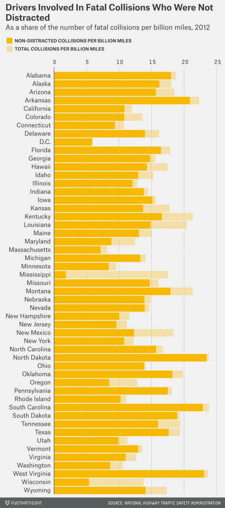
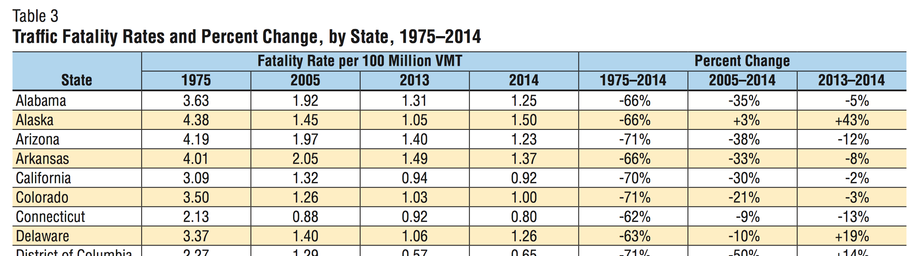

Trying out crosstalk and other packages with data from blog post about examinging 538 data. See https://www.mytinyshinys.com/post/badDrivers_538/ 

Load libraries (note, we need the github version of plotly... `devtools::install_github("ropensci/plotly")` )
```{r}
library(htmltools)

library(plotly)
library(fivethirtyeight)
library(crosstalk)
library(tabulizer)
library(DT)
library(dplyr)
library(tidyr)
library(stringr)
```

I got a file with state information at http://www.fonz.net/blog/wp-content/uploads/2008/04/states.csv . Make it nicer. 

```{r}
states <- read.csv("states.csv") %>% rename(state=State, stateID=Abbreviation) %>% 
                                 mutate_each( funs(as.character), everything())
glimpse(states)
```

Here is the plot to improve...



Let's get the data. The `fivethirtyeight` package has a data set called `bad_drivers`. Column definitions are at https://github.com/fivethirtyeight/data/tree/master/bad-drivers . 

```{r}
df <- bad_drivers
glimpse(df)
```

Let's work on the data. First, remove the insurance and losses columns. Then use `tidyr` to switch from the wide data to a narrow data. To do that, we'll `gather` the `perc_...` columns with title of `cause` and value of `pc` (percent). What we want is number of drivers involved in such accidents per billion miles. The `num_drivers` column is that total number of fatalities per billion miles. So we can convert from percent to absolute number. Finally, we want the abbreviation instead of the state name.

```{r}
df %>%  
  select(1:6) %>%                                       # drop insurance_premiums and losses
  gather(cause, pc, -c(state, num_drivers)) %>%         # Make narrow DF
  mutate(value = round(num_drivers * pc / 100, 1)) %>%  # Absolute values
  left_join(states) -> df_gather

glimpse(df_gather)
```

Let's turn the states into a factor

```{r}
df_gather %>% mutate(state = factor(state, levels=state[order(value)])) -> df_gather
df_gather
```

Set up things for `crosstalk`

```{r}
sd <- SharedData$new(df_gather)  # crosstalk  - data to pass to widgets

fs <- filter_select(   # Create a select box (crosstalk)
  id = "cause",
  label = 'Cause',
  sharedData = sd,
  group = ~ cause,
  allLevels = FALSE,
  multiple = FALSE
  ) 
```

Apparenlty there's extra work to use bootstrap (not sure what that is). There are many `html_dependencies` attributes and we are keeping all of them except for the one named `bootstrap`.
```{r}
fs_nobootstrap <- fs

attr(fs_nobootstrap, "html_dependencies") <- Filter(
  function(dep) {dep$name != "bootstrap"}, attr(fs_nobootstrap, "html_dependencies")
)
```

Make the chart (this doesn't quite look like the blog - that code didn't work). 

```{r}
myChart <- sd %>% 
  plot_ly( 
           x = ~ num_drivers,
           y = ~ state, 
           height = 800) %>% 
  add_bars(width=0.8, color = I("#f2dfa8"), name="Total") %>%   # All fatalities
  add_bars(width=0.2, x = ~ value, y = ~ state, color = I("#F6B900"),  # according to cause
           name = "Cause", hoverinfo = "text", text = ~paste0(pc, "%")) %>% 
  layout(barmode="overlay", 
         title="Drivers involved in Fatal collisions by State - 2012",
         xaxis=list(title="Fatal collisions per billion miles"),
         yaxis=list(title=""),
         margin=list(l=120)) %>% 
  config(displayModeBar=F, showLink=F)

# Conbine chart and selector
tagList(fs_nobootstrap, myChart)
```

It works!!!

Let's try some maps!

```{r}
sd %>% 
  plot_ly(type="choropleth",
          locations = ~ stateID,
          locationmode = "USA-states",
          z = ~ value,
          reversescale = TRUE) %>% 
  layout(geo = list(scope="usa")) -> map

tagList(fs_nobootstrap, map)
```

There seems to be a bug on the web page ... if you select a category from one plot, selecting a category from another plot no longer works. Anyway,...

The blog post goes on to talk about where the data actually comes from. There's a PDF table with some interesting accident data. Here's a copy that I cut and pasted...



We can use the `tabulizer` package to look at it. For some reason, `tabulizer::extract_tables` and regular `download.file` got a 405 error (Method not allowed). Doing `download.file` with `method=wget` works.  Note that for `extract_table`, we don't specify `mode=data.frame` as that turns the first row into column headers. The approach here seems better. 

```{r}
download.file("https://crashstats.nhtsa.dot.gov/Api/Public/ViewPublication/812293", 
              destfile = 'worstDrivers_aux/table3.pdf', method="wget")
crash_data <- extract_tables("worstDrivers_aux/table3.pdf", pages=5 )
df <- as.data.frame(crash_data)
df
```
```{r}
glimpse(df)
```

We have some work to do here. (Note the spurious space after the state name). See http://stackoverflow.com/questions/27668266/dplyr-change-many-data-types for converting several columns. And note that we need to convert the factors to a string first, then numeric. 

```{r}
df %>% select(state=X1, yr_1975=X2, yr_2005=X3, yr_2013=X4, yr_2014=X5) -> df
df %>% mutate(state=str_trim(as.character(state))) %>% 
       mutate_each( funs(as.numeric(as.character(.))), starts_with("yr")) -> df
glimpse(df)
```

And make tidy with state abbreviations
```{r}
df %>% gather(year, rate, -state) %>% left_join(states) -> df_gather
glimpse(df_gather)
```

Let's now map the changes in time for three years. Let's make a function do the repetitive stuff. 

```{r}
makeMap <- function(df, title) {
  df %>% 
  plot_geo(locationmode="USA-states") %>% 
  add_trace( z = ~ rate, color = ~ rate, colors = "Reds", zmin=0, zmax=6, locations = ~stateID,
             showscale=TRUE) %>% 
  layout(geo=list(scope="usa"), title=title) %>% 
  config(displayModeBar=F, showlink=F) -> out
  
  return(out)
}

df_gather %>% filter(year == 'yr_1975') %>% makeMap("1975") -> map_1975
df_gather %>% filter(year == 'yr_2005') %>% makeMap("2005") -> map_2005
df_gather %>% filter(year == 'yr_2014') %>% makeMap("2014") -> map_2014

tagList(map_1975, map_2005, map_2014)
  
```

Try showing a decline in rates.

```{r}
df %>% left_join(states) %>% mutate(change=round(100*yr_2014 / yr_1975 - 100)) %>% 
  plot_geo(locationmode="USA-states") %>% 
  add_trace(z = ~ change, color = ~ change, colors = "Greens", locations = ~ stateID, showscale=T,
            reversescale=T) %>% 
  layout(
    geo=list(scope="usa") %>% config(displayModeBar=F, showLink=F),
    title='% change in rate of fatalities 1975 to 2014') %>%
  config(displayModeBar=F, showLink=F)
```


