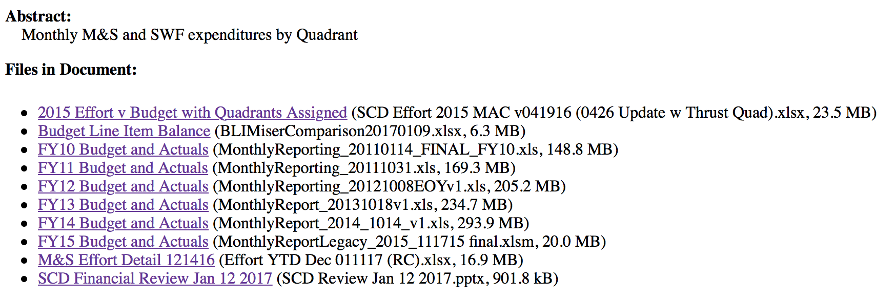

# Introduction

The monthly quadrant reports are not easy to understand. The monthly reports are in CS-doc-3799. You have to look at the version that you want. For this example, the version is http://cd-docdb.fnal.gov:8080/cgi-bin/ShowDocument?docid=3799&version=422

The list of files is,


In general, ignore the document titles, like _Budget Line Item Balance_. They usually completely incorrect. Instead, focus on the file name, like `Effort YTD Dec 011117 (RC).xlsx`. This one is for SWF effort up to December. There's also a presentation that is useful for checking. Here, it is `SCD Review Jan 12 2017.pptx`

## Effort report

The talk budget and actual effort for different months. Let's see how we get these. Here's the picture from the talk.


In the effort spreadsheet, this is on the sheet `Combined FTE trend` with the appropriate items selected (I can get it to match the talk). Let's see where these data come from.

What is marked on the slide as _Depts included_ are really `Project Number`. The data from this sheet comes from `Combined FTE Pivot`. From there, the data source is `Combined FTEs to Pivot`. 

Let's try to reproduce some of these values. 

First, let's download the file SWF file
```{r}
library(httr)
library(readxl)
library(tidyverse)
library(reshape2)
```

```{r}
url <- 'http://cd-docdb.fnal.gov:8080/cgi-bin/RetrieveFile?docid=3799&filename=Effort%20YTD%20Dec%20011117%20%28RC%29.xlsx&version=422'
tmp <- tempfile(fileext='.xlsx')
GET(url, write_disk(tmp), authenticate('cdweb', 'cdpass'))
```

And open the `Data` sheet. There is some confusion when the sheet switches from budget to actual, so we need to specify columns types. Avoid importing a column by setting its type to blank. 

```{r}
coltypes <- c(rep('blank', 8), rep('text', 16), rep('numeric', 2), 'text', 'text', 'numeric', 
              rep('text', 7), rep('numeric', 3), rep('text', 3), rep('numeric', 3), 'text', 
              rep('numeric', 6), rep('text', 3), rep('blank', 15), rep('text', 10))
d <- read_excel(tmp, 'Data', col_types = coltypes)
```

```{r}
glimpse(d)
```

Some notes, `BLI Number` is always blank. Instead, use `bgt_ItemID`. `Project` 9999 is sick, vacation or "opto" time (have to parse `Activity Name` to figure out which).

Let's pull out effort information infomation about me. 

```{r}
nNonPeriodCols=3
d %>% filter(`Employee Name` == 'PARA, ADAM', `Record Type`=='Effort', `Project Number` != 9999) %>% 
  select(  activity=`Activity Name`, project=`Project Number`, srv = ServiceType,
           period=eft_ReportingPeriod, fte=eft_YTDAdjustedEffortyrs ) -> d1
d1
```

 Note that rows are repeated. There's an entry per week (the period doesn't include the week). Let's group over period.
 
```{r}
d1 %>% group_by(activity, project, srv, period) -> d1g
d1g %>% summarize(fte=sum(fte)) -> d1s
d1s
```
 
 
 Let's see if we can match the `Combinded FTE Trend` sheet. We need to spread the dates. See http://stackoverflow.com/questions/35575910/calculate-subtotals-with-dplyr-and-tidyr for how to add the margins (a little tricky).

```{r}
notThese = -1:(-1*nNonPeriodCols)
d1s %>% spread(period, fte, fill=0.0) %>% 
  ungroup() %>% 
  mutate( Total = rowSums(.[notThese])) %>% 
  rbind(., data.frame(activity='Total', project="", srv="", t(colSums(.[notThese])), check.names = F))
```


